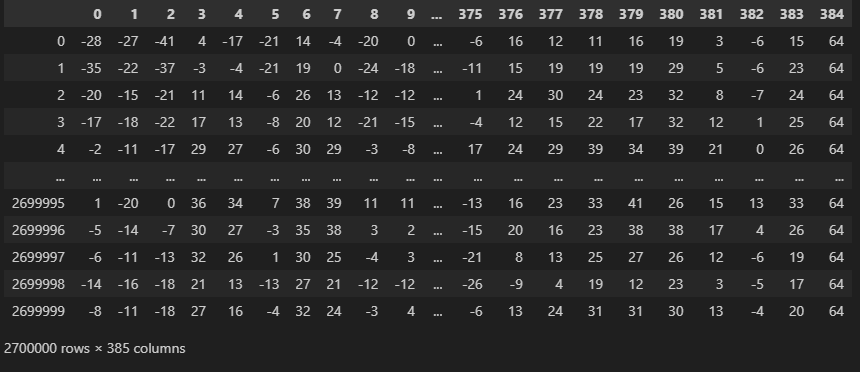
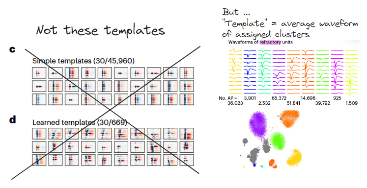
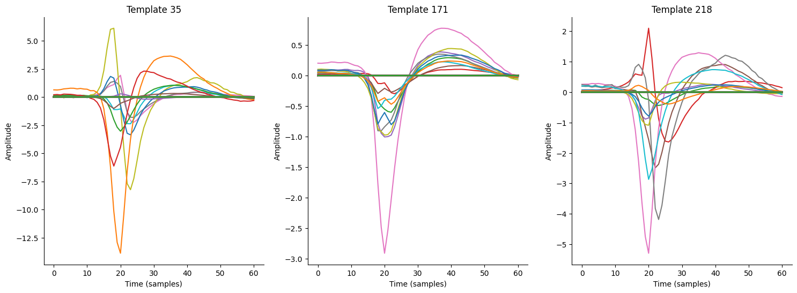
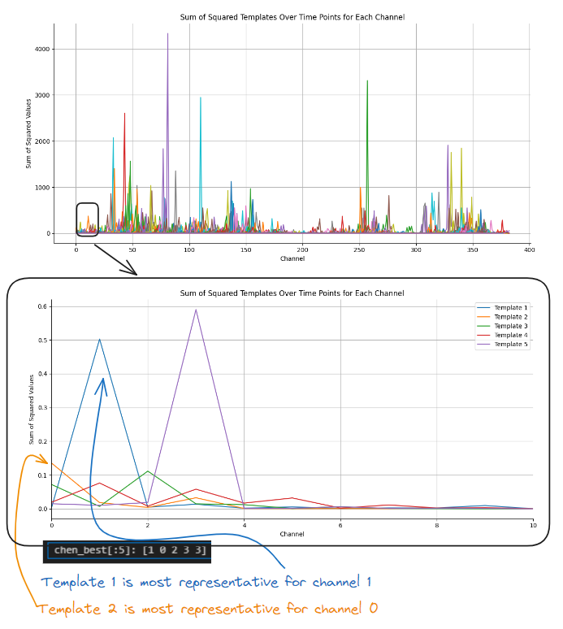
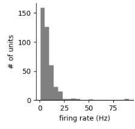
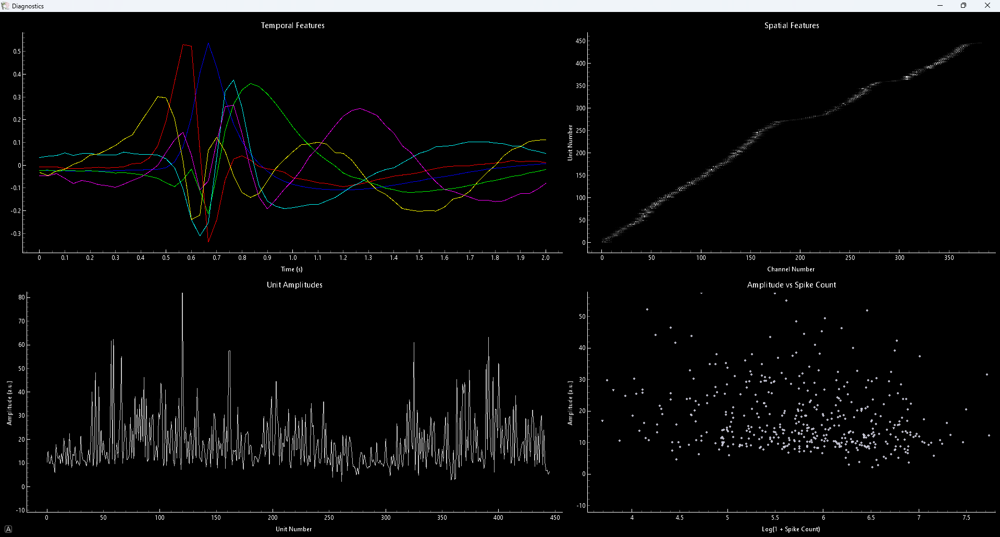
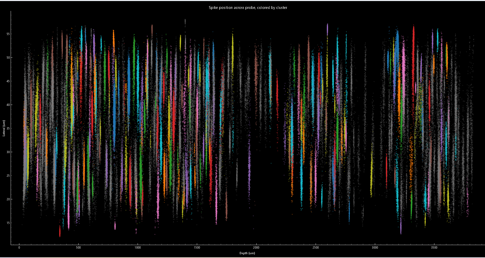

Tags: [[Crow project]]
- 📚 [Kilosort4 — Kilosort4 0.0.1 documentation](https://kilosort.readthedocs.io/en/latest/index.html) (also helpful discussion on parameters: [here](https://kilosort.readthedocs.io/en/latest/parameters.html))
- 📚 Data in tutorial from: [Reproducibility of in vivo electrophysiological measurements in mice | bioRxiv](https://www.biorxiv.org/content/10.1101/2022.05.09.491042v6)


#### Understanding
- Steps: 
- [[2024-09-17 Whitening data]]
- [[2024-10-17 Masking vector (spike sorting)]]
- [[2024-10-17 Matching pursuit]]
- [[01 Notes/Conceptual Ideas Notes/2024-10-18 Drift correction|2024-10-18 Drift correction]]
- [[2023-04-24 K-means]]


#### Install instructions


1. Clone Github Repo
2. Follow appropriate ReadMe instructions, 


	1. Install an [Anaconda](https://www.anaconda.com/products/distribution) distribution of Python. Note you might need to use an anaconda prompt if you did not add anaconda to the path.
	2. Open an anaconda prompt / command prompt which has `conda` for **python 3** in the path
	3. Create a new environment with `conda create --name kilosort python=3.9`. Python 3.10 should work as well.
	4. To activate this new environment, run `conda activate kilosort`
	5. To install kilosort and the GUI, run `python -m pip install kilosort[gui]`
	7. Next, if the CPU version of pytorch was installed (will happen on Windows), remove it with `pip uninstall torch`
	8. Then install the GPU version of pytorch `conda install pytorch pytorch-cuda=11.8 -c pytorch -c nvidia`

3. If Cuda, nvidia drivers not installed yet:

	If step 8 does not work, you need to make sure the NVIDIA driver for your GPU is installed (available [here](https://www.nvidia.com/Download/index.aspx?lang=en-us)). You may also need to install the CUDA libraries for it, we recommend [CUDA 11.8](https://developer.nvidia.com/cuda-11-8-0-download-archive).
	
	If pytorch installation still fails, follow the instructions [here](https://pytorch.org/get-started/locally/) to determine what version of pytorch to install. The Anaconda install is strongly recommended on Windows, and then choose the CUDA version that is supported by your GPU (newer GPUs may need newer CUDA versions > 10.2). For instance this command will install the 11.8 version on Linux and Windows (note the `torchvision` and `torchaudio` commands are removed because kilosort doesn't require them):
	
	`conda install pytorch pytorch-cuda=11.8 pynvml -c pytorch -c nvidia`
	
	This [video](https://www.youtube.com/watch?v=gsixIQYvj3U) has step-by-step installation instructions for NVIDIA drivers and pytorch in Windows (ignore the environment creation step with the .yml file, we have an environment already, to activate it use `conda activate kilosort`).


4. Add missing packages `pip install ipykernel pandas`

5. Then downgrade numpy to be below 2.0.0 ([NumPy 2.0 compatibility · Issue #722 · MouseLand/Kilosort](https://github.com/MouseLand/Kilosort/issues/722)), `pip install --upgrade numpy<"2.0.0"`


#### Pipeline steps

##### Raw data format

- Example filename: 'ZFM-02370_mini.imec0.ap.bin'
- .ap - action potential data, contrast with .lfp
- .bin - binarized data in column format:
	- n_rows = number of samples (each time sample has duration $\frac{1}{\text{sampling rate}} =\frac{1}{30000} =0.33ms$)
	- n_cols = number of channels
	- values in cells = since extracellular recordings, presumably in $\mu V$


- converted .ap.bin file to df for understanding
- duration of recording: num rows/fs = $\frac{2700000}{300000}= 90s$ ([[2024-11-01 Sampling rate & number of data points]])

##### Data loading

- ⚠️ Provided `urlib.request` sometimes has problems, for tutorial can just download manually and add to folder


##### File path management

- ⚠️ Take the directory in which ``SAVE_PATH`` is (defined by where is stored 'ZFM-02370_mini.imec0.ap.bin'),
- ❌ number of channels has to be specified in settings

```python
# SAVE_PATH.parent - file directory containg the binary file
settings = {'data_dir': SAVE_PATH.parent, 'n_chan_bin': 385}

```


- ⚠️ Take the root folder of `SAVE_PATH`, which is stored in `settings['data_dir']`, and create folder `kilosort`.
- E.g. if `SAVE_PATH` in `docs\tutorials`, `results_dir` = ``docs\tutorials\kilosort4``
```python
# outputs saved to results_dir
results_dir = Path(settings['data_dir']).joinpath('kilosort4')
```


- ⚠️ `results_dir` / ``docs\tutorials\kilosort4`` $\rightarrow$ where during `run_kilosort` all the output files are stored, 

```python
ops, st, clu, tF, Wall, similar_templates, is_ref, est_contam_rate, kept_spikes = \
    run_kilosort(
        settings=settings, probe_name='neuropixPhase3B1_kilosortChanMap.mat',
        # save_preprocessed_copy=True
        )
```


- ⚠️ these output files (.tsv, .npy, etc.) can then be retrieved as variables
```python
ops = load_ops(results_dir / 'ops.npy')
camps = pd.read_csv(results_dir / 'cluster_Amplitude.tsv', sep='\t')['Amplitude'].values
contam_pct = pd.read_csv(results_dir / 'cluster_ContamPct.tsv', sep='\t')['ContamPct'].values
chan_map =  np.load(results_dir / 'channel_map.npy')
templates =  np.load(results_dir / 'templates.npy')
chan_best = (templates**2).sum(axis=1).argmax(axis=-1)
chan_best = chan_map[chan_best]
amplitudes = np.load(results_dir / 'amplitudes.npy')
st = np.load(results_dir / 'spike_times.npy')
clu = np.load(results_dir / 'spike_clusters.npy')
firing_rates = np.unique(clu, return_counts=True)[1] * 30000 / st.max()
dshift = ops['dshift']
```


#### Output files of `run_kilosort`

- 📚 Text (partially) taken from documentation in ``Kilosort\kilosort\io.py``
- The following files (and some others not used in tutorial) will be saved in `results_dir`

##### Meta data: `ops`

ops.npy : shape N/A
	`ops`
	Dictionary containing a number of state variables saved throughout
	the sorting process (see `run_kilosort`). We recommend loading with
	`kilosort.io.load_ops`.


##### Understanding : `chan_best` for raster plot 

Note that 'template' here does not refer to the universal or learned templates used for spike detection, as it did in some past versions of Kilosort. Instead, it refers
to the average spike waveform (after whitening, filtering, and drift
correction) for all spikes assigned to each cluster, which are template-like
in shape. We use the term 'template' anyway for this section because that is
how they are treated in Phy. Elsewhere in the Kilosort4 code, we would refer
to these as 'clusters.'



- in ``Kilosort\kilosort\io.py`` with "templates", they mean the thing on the right


channel_map.npy : shape (n_channels,)
	`chan_map`
	Same as probe['chanMap']. Integer indices into rows of binary file
	that map the data to the contacts listed in the probe file.


spike_clusters.npy : shape (n_spikes,)
	`clu`
	For each spike, integer indicating which template it was assigned to.

spike_times.npy : shape (n_spikes,)
	`st`
	Sample index of the waveform peak for each spike.

templates.npy : shape (n_templates, nt, n_channels $\rightarrow$ $i, t, j$)
	Full time x channels template shapes.
	- e.g. (n_templates, nt, n_channels) = (396, 62, 384)
		- where nt = number of time points in each template (template length: $5ms$)




- example of 3 different templates, for all nt (x-axis) and all channels (colours)


- ⚠️ `Templates (n_templates, nt, n_channels)` are averaged waveforms (over $5ms$ with 60 nt) for all the neurons detected within the same cluster. `chan_best` is a list indexed by `n_templates` that for each template describes which channel has the most representative sum of detected waveforms similar to the template waveform

- ❓ `chan_best = chan_map[chan_best]`


`chan_best`
- shape (n_templates) 

```python
templates =  np.load(results_dir / 'templates.npy')
chan_best = (templates**2).sum(axis=1).argmax(axis=-1)
```


- $i$ - templates, $t$ - time points 
- `.sum(axis=1)` $\rightarrow$ summing over time points (axis=1) $$\text{sum\_squared}[i,j] = \sum_{t=1}^{62} (\text{templates}[i,t,j])^2 $$
- Then apply `.argmax(axis=-1)` $\rightarrow$ index of the maximum value along **`axis=-1`**, which corresponds to the channels $j$
$$\text{chan\_best}[i]=\text{argmax}​(\text{sum\_squared}[i,j])$$





- ⚠️ `clu` is an integer indicating, for each spike, which template the spike is assigned to. By passing `chan_best[clu]`, we get the channel number for each spike, since it's most likely that the spike originated from the channel where its associated template is most likely. 


##### Firing rate activity

spike_clusters.npy : shape (n_spikes,)
	`clu`
	For each spike, integer indicating which template it was assigned to.


```python
clu = np.load(results_dir / 'spike_clusters.npy')
firing_rates = np.unique(clu, return_counts=True)[1] * 30000 / st.max()
```

- ⚠️ $\text{firing\_rate} = \frac{\text{spike count}}{T} \times f_{s}$ 
- ([[2024-11-01 Sampling rate & number of data points]])

```python
unique_elements, counts = np.unique([1, 2, 2, 2, 4, 4], return_counts=True)
# Output
Unique elements: [1 2 4]
Counts: [1 3 2]
```

`clu`: shape(n_spikes) $\rightarrow$ ``firing_rates``: shape(n_templates)



##### Amplitude
amplitudes.npy : shape (n_spikes,)
	`amplitudes`
	Per-spike amplitudes, computed as the L2 norm of the PC features
	for each spike.

cluster_Amplitude.tsv : shape (n_templates,)
	`camps`
	Per-template amplitudes, computed as the L2 norm of the template.

- ❓ no access to the voltage amplitude???

##### MUA vs Good units 

cluster_ContamPct.tsv : shape (n_templates,)
	`contam_pct`
	Contamination rate for each template, computed as fraction of refractory
	period violations relative to expectation based on a Poisson process.


- 📚 [Pillow et al.,  2013](https://doi.org/10.1371/journal.pone.0062123) " We quantify these errors in terms of the “contamination rate” for each neuron, defined as the ratio of the frequency of occurrence of spikes within the refractory period (1.5ms) to the baseline frequency of spikes outside this window."
- ❓ They cited this paper, but I am not sure they implemented it the same way, saw nothing about that clearly in the methods of the paper


```python
good_units = np.nonzero(contam_pct <= 0.1)[0]
mua_units = np.nonzero(contam_pct > 0.1)[0]

# np.nonzero
# Fnd the indices of non-zero elements
[1, 3, 4, 6] = np.nonzero([0, 3, 0, 4, 5, 0, 7])
```


#todo 
- [ ] look at waveform plotting of single

#### GUI screenshots






